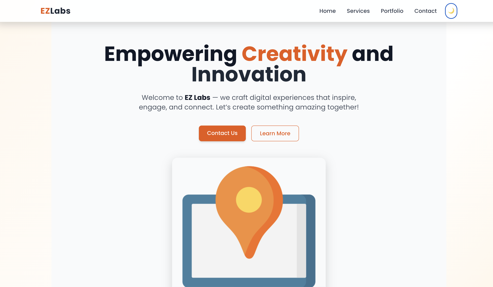
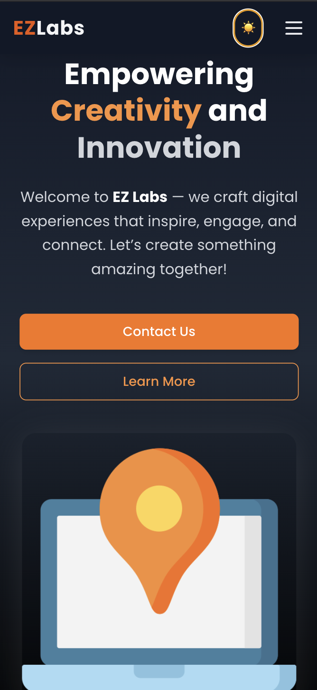

# 🎬 EZ Labs Frontend Assessment

**Live Project:** [https://ezlabs-homepage.vercel.app] (https://ezlabs-homepage.vercel.app)
**GitHub Repository:** [https://github.com/pravesh5122003/ezlabs-homepage](https://github.com/pravesh5122003/ezlabs-homepage)

---

## 🚀 Project Overview

This project was developed as part of the **EZ Labs Frontend Assessment**.  
It is a fully responsive, pixel-perfect React website designed according to the given Figma UI and requirements PDF.  

The website represents **EZ Labs’ creative and technology-driven brand**, showcasing sections like:
- Hero Section   
- Services (Film Production, Branding, Art Curation)  
- Portfolio  
- Contact Form (with validation + API integration)

---

## 🧩 Features Implemented

✅ Fully Responsive Layout (Desktop → Tablet → Mobile)  
✅ Light/Dark Mode Toggle
✅ Animated Hero Section using **Framer Motion**  
✅ About, Services, and Portfolio Sections 
✅ Smooth Scroll Navigation between sections  
✅ Modern UI built using **React + Tailwind CSS + Vite**  
✅ Contact Form with validation (Name, Email, Phone, Message)  
✅ Postman Verified API Response (Status: 201 Created)  
✅ API Integrated Form Submission (`https://vernanbackend.ezlab.in/api/contact-us/`)  
✅ Hosted on **Vercel** for production deployment  

---

## 📸 Project Preview

### 🌗 Dark & Light Mode
| Light Mode | Dark Mode |
|-------------|------------|
|  |  |


---

## 🛠️ Tech Stack

| Technology | Purpose |
|-------------|----------|
| **React (Vite)** | Frontend framework |
| **Tailwind CSS** | Styling and responsiveness |
| **Framer Motion** | Smooth animations |
| **Axios** | API handling |
| **React Hook Form** | Form validation |
| **Vercel** | Hosting and deployment |

---

## 🧮 Folder Structure

ezlabs-homepage/
│
├── src/
│ ├── components/
│ │ ├── Navbar.jsx
│ │ ├── Hero.jsx
│ │ ├── About.jsx
│ │ ├── Services.jsx
│ │ ├── Portfolio.jsx
│ │ └── ContactForm.jsx
│ │
│ ├── App.jsx
│ ├── main.jsx
│ └── index.css
│
├── public/
├── package.json
└── tailwind.config.js

---

## 🧠 Learning Highlights
- Improved responsive design skills with **Tailwind CSS**
- Implemented **form validation and API handling** with Axios + React Hook Form
- Learned **CI/CD deployment** using GitHub + Vercel
- Enhanced understanding of real-world frontend workflows

---

## ⚙️ Setup Instructions

Follow these steps to run this project locally 👇

### ** Clone the repository**
```bash
git clone https://github.com/pravesh5122003/ezlabs-homepage.git
cd ezlabs-homepage
npm install
npm run dev

## 💬 API Integration Details

**Contact Form API Endpoint:**  

**Request Method:** `POST`  
**Content-Type:** `application/json`

---

### 📨 Example Request Body

```json
{
  "name": "Pravesh sachan",
  "email": "pravesh@gmail.com",
  "phone": "9044379193",
  "message": "This is a test message from the contact form."
}

{
  "message": "Contact request submitted and email sent successfully",
  "data": {
    "id": 3503,
    "name": "Pravesh sachan",
    "email": "pravesh@gmail.com",
    "phone": "9044379193",
    "message": "This is a test message from Postman to verify API connectivity.",
    "created_at": "2025-11-08T19:20:49.075863Z",
    "updated_at": "2025-11-08T19:20:49.075812Z"
  }
}


## 👨‍💻 Developer

**Pravesh Sachan**  
Frontend Developer | React Enthusiast  
📍 India  
💼 [LinkedIn](https://www.linkedin.com/in/pravesh-sachan/) | [GitHub](https://github.com/pravesh5122003)

---

